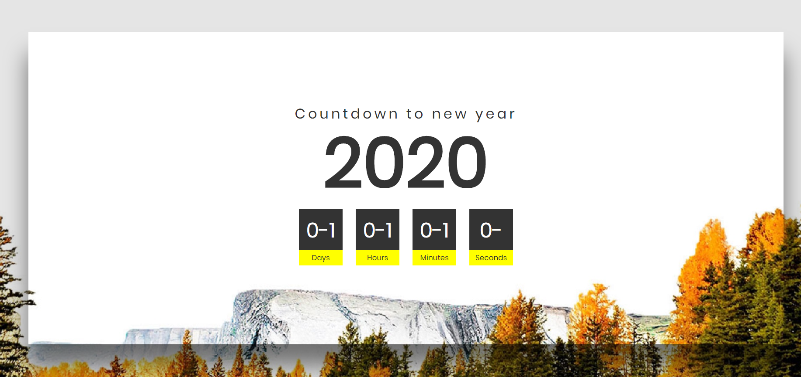

# 说明书(并不是)
### 图片线上地址 [打开链接](https://drive.google.com/file/d/1VhbsPWgi4ZwgyXXrrJZIT9f00gtFKCaO/view),原尺寸 1366x768,为了适应高清屏幕,修改为了1920x1080

### 字体链接 [点击打开](https://fonts.google.com/specimen/Poppins?selection.family=Poppins),其实字体样式可忽略

### 增加的`加0`方法只是为了看起来舒服一些,不习惯的话可以去掉

### 原视频中只是到2020年,[mingchen3398](https://weibo.com/mingchen3398)将年份变成变量,(原则上)可实现自动下一年

### 增加手机端适配,若不适应,可去掉`<link rel="stylesheet" href="./css/response.css">`

### 由于不是每秒都调年份的方法,导致出现负数,已修复


### ----------------------------------------------splitLine--------------------------------
###  [预览地址](https://mingchen3398.github.io/newyear/)

### 若代码有不妥之处(bug)可联系:
weibo:[mingchen3398](https://weibo.com/mingchen3398)

Bilibili:[BILI_SHENHAN](https://space.bilibili.com/86906776)

```js
//TODO
````
